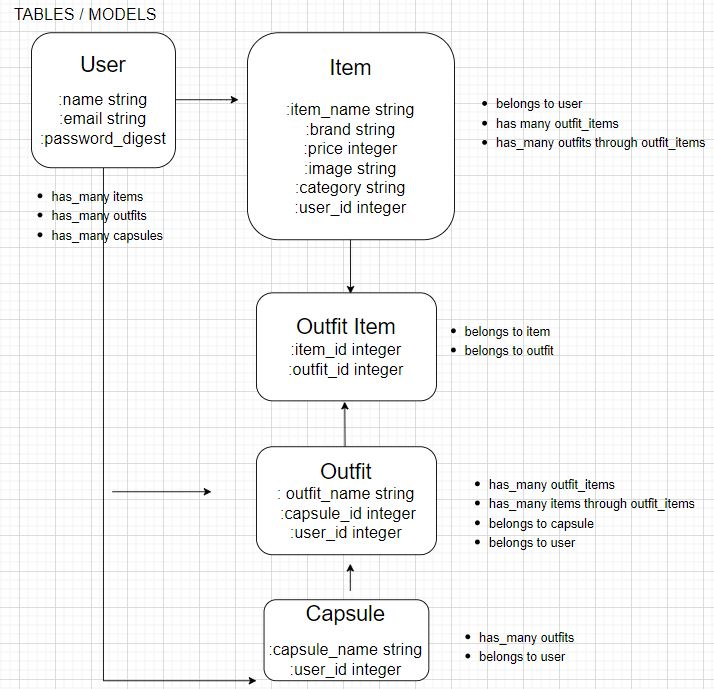

# Phase 5 Project - Capsule Closet


## Description
Capsule Closet is a closet organization tool allowing users to create capsule wardrobes and create outfits based on items in their closet. A user is able to create, delete and edit pieces in their virtual closet. By being able to visualize your closet and creating different outfit combinations, you will never run out of outfit ideas.


## Demo


Demo Link: https://www.loom.com/share/b0d6bc55d64a43ccb883be34c0c71c04


## Overview
Full stack application built with React on the front end and Rails on the backend. Frontend built with Material UI library and React Slick for carousel feature.





## Requirements
- Ruby v2.7.4
- Rails v6.1.3
- node v16.13.2
- Postgresql v1.1
- bcrypt v3.1.7
- Material UI v5.10.6
- Material UI Carousel v3.4.2
- React Slick v0.29.0
- Slick Carousel 1.8.1


## Installation
1. Fork and clone this repository

2. cd into the project and run 

```console 
$ bundle install
$ npm install --prefix client
```

3. To start the application

```console 
$ rails s
$ npm start --prefix client
```

4. The backend will run on http://localhost:3000

5. The frontend will run on http://localhost:4000

## Contributing
Pull requests are welcome. For any major changes, please feel free to reach out to discuss the changes. 


## License
MIT License

Copyright (c) [2022] [Janice Chan]

Permission is hereby granted, free of charge, to any person obtaining a copy
of this software and associated documentation files (the "Software"), to deal
in the Software without restriction, including without limitation the rights
to use, copy, modify, merge, publish, distribute, sublicense, and/or sell
copies of the Software, and to permit persons to whom the Software is
furnished to do so, subject to the following conditions:

The above copyright notice and this permission notice shall be included in all
copies or substantial portions of the Software.

THE SOFTWARE IS PROVIDED "AS IS", WITHOUT WARRANTY OF ANY KIND, EXPRESS OR
IMPLIED, INCLUDING BUT NOT LIMITED TO THE WARRANTIES OF MERCHANTABILITY,
FITNESS FOR A PARTICULAR PURPOSE AND NONINFRINGEMENT. IN NO EVENT SHALL THE
AUTHORS OR COPYRIGHT HOLDERS BE LIABLE FOR ANY CLAIM, DAMAGES OR OTHER
LIABILITY, WHETHER IN AN ACTION OF CONTRACT, TORT OR OTHERWISE, ARISING FROM,
OUT OF OR IN CONNECTION WITH THE SOFTWARE OR THE USE OR OTHER DEALINGS IN THE
SOFTWARE.